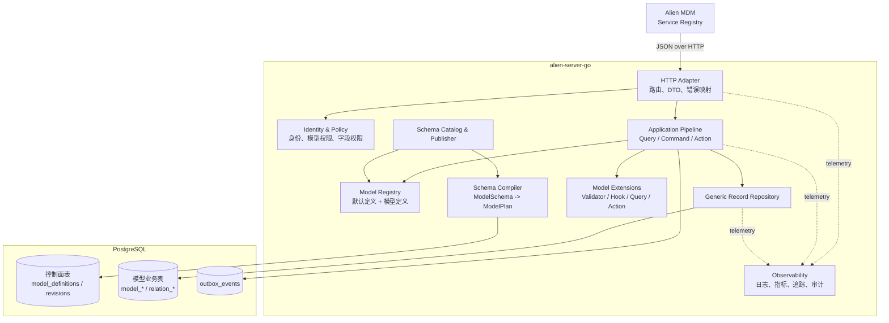
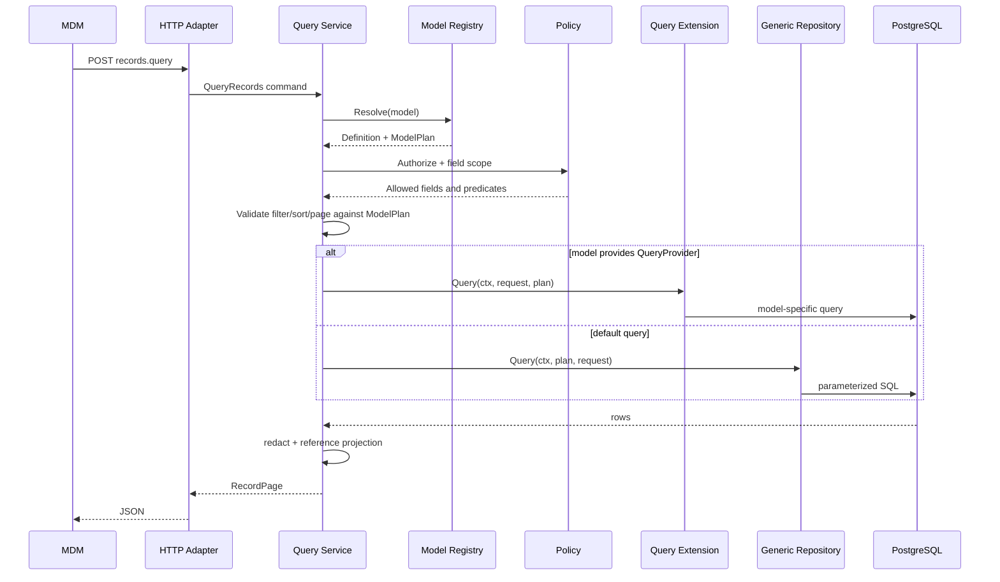
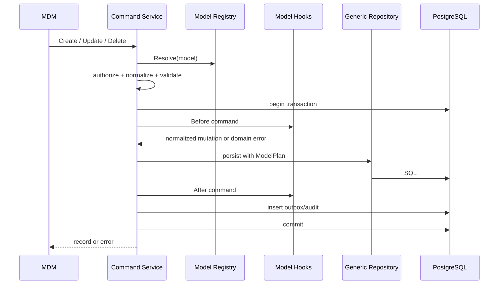
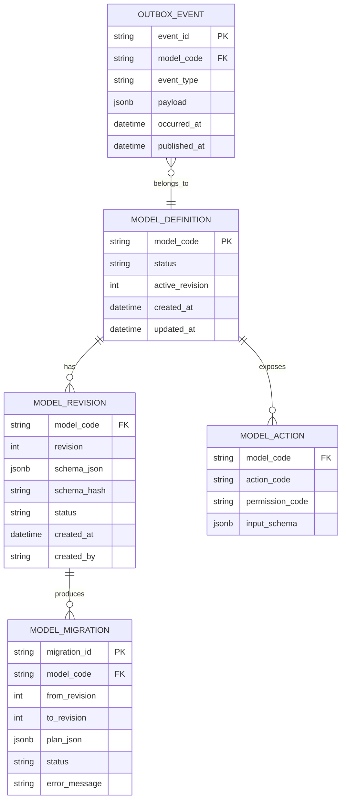
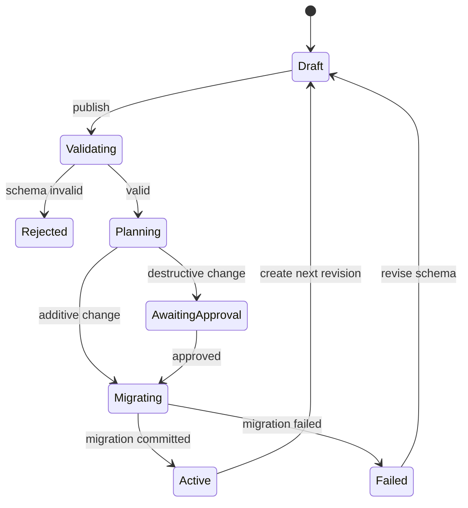

# Alien Form Go 后端架构设计

## 文档定位

| 维度     | 结论                                      |
| -------- | ----------------------------------------- |
| 文档类型 | 技术架构与概要设计                        |
| 系统阶段 | 从现有 Node/Hono 演示后端迁移到 Go        |
| 主要读者 | 前端架构设计者、Go 后端工程师、设计评审者 |
| 复杂度   | 中等，覆盖模块、接口、数据与迁移          |
| 上游输入 | 当前仓库实现与方向性需求，没有独立 PRD    |

当前前端已经形成 `ModelSchema -> ModelPageBuilder -> PageSchema -> PageCompiler -> PageRuntime` 的稳定链路，后端也已经用同一份 `ModelSchema` 投影 SQLite DDL 和通用 CRUD。[Data-backed]

本设计把 Go 后端定位为模型驱动平台的服务端实现。它提供统一的模型发布、记录查询、记录写入、权限、事务和可观测流程，同时允许特定模型替换查询、校验、写入或动作逻辑。[Expert judgment]

以下前提需要在实施前确认：

- 首个生产形态以单团队维护、单区域部署为主。[Hypothesis]
- 业务规模尚未要求按模型拆分独立服务或数据库。[Hypothesis]
- 前后端可以在一次版本发布中同步切换接口，不需要长期兼容旧 HTTP 路径。[Hypothesis]
- `ModelSchema` 继续作为模型配置、存储能力和前端展示声明的唯一真相源。[Data-backed]

## 设计目标

### 目标

1. 所有普通模型复用同一套鉴权、校验、查询、事务、审计和错误处理流程。[Expert judgment]
2. 特殊模型通过显式注册的能力接口扩展，不在路由、通用 Service 或 Repository 中加入 `if model == "..."`。[Expert judgment]
3. `ModelSchema` 经过后端编译后生成不可变的 `ModelPlan`，运行时只消费编译结果，不重复解释原始 JSON。[Expert judgment]
4. 前端继续以 `schema.*`、`records.*` 等 Service code 作为稳定语义接口，HTTP 只是传输适配。[Data-backed]
5. 系统先以模块化单体交付，模块边界可以在以后按负载或组织边界拆成服务。[Expert judgment]

### 非目标

- Go 后端不解释 `x-layout`、`x-table`、i18n 和 UI 组件实现，只校验并透传前端拥有的展示信息。[Data-backed]
- 第一阶段不引入微服务、事件总线、分布式事务和 Kubernetes 作为必选前提。[Expert judgment]
- 通用 CRUD 不覆盖审批、计费、库存扣减等完整业务流程；这些能力使用模型动作或独立领域模块表达。[Expert judgment]
- 不把任意用户输入直接拼接为 SQL 标识符、表达式或排序语句。[Expert judgment]

## 总体架构

推荐采用模块化单体、端口适配器和命令查询分离的组合。模块化单体降低首次 Go 重构的部署与调试成本；端口适配器隔离 HTTP、数据库和业务规则；命令查询分离让读取投影和事务写入拥有不同扩展点。[Expert judgment]



图 1：Go 后端逻辑架构

HTTP Adapter 只负责协议转换，不直接访问数据库。Application Pipeline 组织固定处理顺序，Model Registry 返回当前模型的 `ModelPlan` 与扩展能力。普通模型进入 Generic Record Repository；特殊模型可以在明确的扩展点增加规则，或者完整替换某一种查询能力。Schema Catalog 负责模型版本和发布，Schema Compiler 把原始配置编译成运行时计划。PostgreSQL 同时保存控制面元数据与模型业务数据，但两者使用不同 schema 或表名前缀隔离。[Expert judgment]

### 控制面与数据面

| 平面   | 输入                 | 产物                                         | 调用频率 | 一致性要求             |
| ------ | -------------------- | -------------------------------------------- | -------- | ---------------------- |
| 控制面 | `ModelSchema`        | 已校验的 `ModelPlan`、DDL 迁移计划、模型版本 | 低       | 发布过程强一致         |
| 数据面 | 查询、命令、模型动作 | 记录、列表、领域结果                         | 高       | 单模型写入默认事务一致 |

这一区分解决两个问题。模型定义只在发布时编译一次，数据请求无需反复解析 marker；DDL 失败也不会让半成品 Schema 进入运行时。[Expert judgment]

## 技术选型

| 领域         | 推荐选择                               | 理由                                                                                                                             | 暂不选择                                                                                      |
| ------------ | -------------------------------------- | -------------------------------------------------------------------------------------------------------------------------------- | --------------------------------------------------------------------------------------------- |
| HTTP         | `net/http` + `chi`                     | 接近标准库语义，中间件组合简单，迁移自 Hono 时认知成本低。[Expert judgment]                                                      | Gin 的 Context 侵入更强；完整 Web 框架对当前 API 价值有限。[Expert judgment]                  |
| 数据库       | PostgreSQL                             | 支持事务、约束、JSONB、并发 DDL 和成熟运维，适合从 SQLite 演示实现进入生产。[Expert judgment]                                    | SQLite 适合单机演示，不适合作为多实例写入的默认生产存储。[Expert judgment]                    |
| 数据访问     | `pgxpool` + 内部受限 SQL Builder       | 动态模型的表名、字段和过滤条件来自编译计划，静态 ORM 映射不能自然覆盖；`pgx` 提供直接、可控的 PostgreSQL 接口。[Expert judgment] | 全量 ORM 会制造动态模型与静态 struct 的冲突；手写字符串拼 SQL 缺少安全边界。[Expert judgment] |
| 固定表迁移   | `goose`                                | 适合管理控制面固定表的版本化 SQL。[Expert judgment]                                                                              | 不让通用迁移工具直接解释动态 `ModelSchema`。[Expert judgment]                                 |
| 动态模型迁移 | 自有 `MigrationPlanner`                | 需要比较 Schema revision、限制破坏性变更并记录发布状态，属于平台领域能力。[Expert judgment]                                      | 启动时静默补列无法表达删除、改名、类型变化与回滚。[Data-backed]                               |
| 配置         | 环境变量 + 显式 Config struct          | 启动参数可验证、可测试，不依赖全局读环境变量。[Expert judgment]                                                                  | 业务代码到处读取环境变量。[Expert judgment]                                                   |
| 日志         | 标准库 `slog`                          | 结构化日志和 `context.Context` 足够覆盖基础需求。[Expert judgment]                                                               | 首期不增加额外日志 facade。[Expert judgment]                                                  |
| 可观测       | OpenTelemetry                          | HTTP、SQL 和业务 span 使用统一上下文，可对接不同后端。[Expert judgment]                                                          | 在业务代码中绑定某个监控厂商 SDK。[Expert judgment]                                           |
| API 描述     | OpenAPI 3.1                            | 固定 HTTP 接口可以生成前端类型和契约测试；动态记录值继续由 `ModelSchema` 描述。[Expert judgment]                                 | 用 OpenAPI 展开每个动态模型的所有字段，会造成规格持续膨胀。[Expert judgment]                  |
| 测试         | 标准库 `testing` + `testcontainers-go` | 单元测试覆盖编译和策略，PostgreSQL 集成测试验证真实 SQL 与事务行为。[Expert judgment]                                            | 仅使用 mock 无法发现方言、约束和迁移问题。[Expert judgment]                                   |

### 为什么不先拆微服务

模型注册、Schema 发布、通用记录仓储和模型特例共享强一致的注册信息与事务边界。过早拆分会引入配置同步、跨服务鉴权、分布式追踪和发布顺序问题，而当前没有独立扩缩容或团队自治证据。[Expert judgment]

模块化单体仍然要求单向依赖。每个领域通过 Go interface 暴露端口，其他模块不能直接读取其数据库表。未来只有出现独立容量、故障隔离或团队所有权需求时，才把模块端口替换为 RPC 或消息适配器。[Expert judgment]

## 代码组织

```text
apps/alien-server-go/
  cmd/
    server/
      main.go
    migrate/
      main.go
  internal/
    bootstrap/
      app.go
      register.go
    platform/
      config/
      database/
      httpx/
      identity/
      observability/
      clock/
      idgen/
    schema/
      domain/
      application/
      ports/
      adapters/postgres/
      transport/http/
    record/
      domain/
      application/
      ports/
      adapters/postgres/
      transport/http/
    modelruntime/
      registry.go
      definition.go
      plan.go
      compiler.go
      extension.go
    models/
      schooluser/
        register.go
        policy.go
        hooks.go
        actions.go
      schooldepartment/
        register.go
        query.go
  migrations/
    0001_control_plane.sql
  openapi/
    api.yaml
  go.mod
  Makefile
```

`schema` 拥有模型定义、版本和发布；`record` 拥有标准记录操作；`modelruntime` 拥有编译结果与注册机制；`models/*` 只保存特定模型的业务差异。`bootstrap/register.go` 是所有注册行为的唯一入口，与当前前端将注册集中到 `register/global` 的原则一致。[Data-backed]

`internal` 阻止其他 Go module 直接依赖应用内部实现。领域模块只依赖自身的 domain/ports 和少量 platform 抽象，transport 与 PostgreSQL adapter 位于最外层。[Expert judgment]

## 核心模型

### ModelSchema

Go 后端定义与前端 JSON 同构的 wire struct，只强类型化后端拥有的字段。`x-layout`、`x-table`、i18n 和 constants 使用 `json.RawMessage` 或宽松 JSON 类型透传。[Expert judgment]

```go
type ModelSchema struct {
    Meta       ModelMeta                   `json:"meta"`
    Properties map[string]ModelFieldSchema `json:"properties"`
    Layout     json.RawMessage             `json:"x-layout"`
    I18n       json.RawMessage             `json:"i18n,omitempty"`
    Constants  json.RawMessage             `json:"constants,omitempty"`
}

type DatabaseMeta struct {
    Type       ColumnType   `json:"type,omitempty"`
    Nullable   *bool        `json:"nullable,omitempty"`
    Default    any          `json:"default,omitempty"`
    Unique     bool         `json:"unique,omitempty"`
    Index      bool         `json:"index,omitempty"`
    Filterable *bool        `json:"filterable,omitempty"`
    Sortable   *bool        `json:"sortable,omitempty"`
    Relation   RelationKind `json:"relation,omitempty"`
    Target     string       `json:"target,omitempty"`
    Through    string       `json:"through,omitempty"`
}
```

前后端不复制维护两份完整类型定义。仓库应新增语言无关的 JSON Schema 或契约样例作为 wire contract，再分别生成或校验 TypeScript 与 Go 类型。[Expert judgment]

### ModelPlan

`ModelPlan` 是 Schema Compiler 的不可变输出，也是数据面唯一读取的模型描述。[Expert judgment]

```go
type ModelPlan struct {
    Code       string
    Revision   int64
    Table      Identifier
    Fields     map[string]FieldPlan
    Relations  map[string]RelationPlan
    Filterable map[string]FilterPlan
    Sortable   map[string]SortPlan
    Sensitive  map[string]struct{}
}
```

`Identifier` 只能由编译器在模型发布阶段创建。请求参数只能引用 `ModelPlan` 中已有的字段 key，Repository 再映射到受信任的物理标识符；请求值始终使用 SQL 参数占位符。[Expert judgment]

### Registry

Registry 是运行时单一真相源，保存默认定义和模型级定义。注册在启动期完成，启动后冻结；重复注册直接失败。[Expert judgment]

```go
type Definition struct {
    Code       string
    PlanSource PlanSource
    Policy     Policy
    Extensions ExtensionSet
}

type Registry interface {
    Register(def Definition) error
    Resolve(model string) (Definition, error)
    Freeze() error
}
```

解析规则固定为：

```text
模型专属能力
  -> 平台默认能力
  -> 未注册能力错误
```

覆盖发生在能力粒度，例如只替换 `QueryProvider`，不会复制整个模型定义。Registry 不保存请求状态，不在运行时动态修改。[Expert judgment]

## 标准处理管线

### 查询管线



图 2：标准查询流程与模型级替换点

权限策略先收缩可访问字段和数据范围，随后校验筛选与排序字段。模型没有注册 `QueryProvider` 时进入通用 Repository；注册后由专属查询实现负责读取，但仍必须接受已经解析的 `Principal`、`ModelPlan` 和权限范围。[Expert judgment]

### 写入管线



图 3：标准写入流程

`Before` hook 可以补充派生值或拒绝命令，`After` hook 只能执行同一事务内的业务副作用，例如写审计记录或 outbox。邮件、Webhook 等外部调用不能占用数据库事务；它们由 outbox consumer 在提交后处理。[Expert judgment]

标准写入顺序固定为：

1. 解析身份与请求 ID。
2. 从 Registry 获取 Definition 和指定 revision 的 ModelPlan。
3. 执行模型级与字段级授权。
4. 规范化输入，拒绝未知字段。
5. 按 Schema 与扩展 Validator 校验。
6. 开启事务并运行 `Before` hook。
7. 通过 Repository 写入主表和关系表。
8. 运行 `After` hook，写入审计与 outbox。
9. 提交事务，读取并返回公开投影。

## 特殊模型扩展

扩展接口按能力拆分，模型只实现需要改变的部分。避免一个包含大量可选方法的 `ModelHandler`，也避免继承式基类。[Expert judgment]

```go
type Validator interface {
    Validate(ctx context.Context, cmd MutationCommand, plan ModelPlan) error
}

type MutationHook interface {
    Before(ctx context.Context, tx Tx, cmd *MutationCommand, plan ModelPlan) error
    After(ctx context.Context, tx Tx, result MutationResult, plan ModelPlan) error
}

type QueryProvider interface {
    Query(ctx context.Context, req QueryRequest, plan ModelPlan, scope AccessScope) (RecordPage, error)
}

type RecordPresenter interface {
    Present(ctx context.Context, record Record, plan ModelPlan, scope AccessScope) (Record, error)
}

type ActionHandler interface {
    Execute(ctx context.Context, req ActionRequest, plan ModelPlan, scope AccessScope) (any, error)
}

type ExtensionSet struct {
    Validators []Validator
    Hooks      []MutationHook
    Query      QueryProvider
    Presenter  RecordPresenter
    Actions    map[string]ActionHandler
}
```

### 扩展选择

| 需求                | 使用能力              | 示例                         |
| ------------------- | --------------------- | ---------------------------- |
| 增加字段校验        | `Validator`           | 用户名格式、课程时间冲突     |
| 写入前补派生字段    | `MutationHook.Before` | 根据姓名生成检索规范值       |
| 同事务写附属表      | `MutationHook.After`  | 用户变更时写权限映射         |
| 完全自定义列表查询  | `QueryProvider`       | 聚合报表、递归组织树         |
| 隐藏或计算输出字段  | `RecordPresenter`     | 删除密码摘要、计算状态文案   |
| CRUD 之外的业务操作 | `ActionHandler`       | 停用账号、发布课程、复制模型 |

`school-user` 的敏感字段过滤目前写在通用 records route 中。[Data-backed] Go 实现应把它注册为 `schooluser.RecordPresenter` 或字段策略，使通用路由不认识 `school-user`。[Expert judgment]

```go
func RegisterModels(r *modelruntime.Registry, deps Dependencies) error {
    if err := r.Register(modelruntime.DefaultDefinition(deps)); err != nil {
        return err
    }
    if err := schooluser.Register(r, deps); err != nil {
        return err
    }
    if err := schooldepartment.Register(r, deps); err != nil {
        return err
    }
    return r.Freeze()
}
```

所有注册集中在 `bootstrap/register.go`。模型包不能通过 `init()` 隐式注册，因为隐式顺序不利于测试，也无法可靠发现重复 code。[Expert judgment]

### 扩展边界

- Hook 不自行提交或回滚事务，事务所有权属于 Application Pipeline。[Expert judgment]
- QueryProvider 不绕过 Policy；它收到的是已经计算出的 `AccessScope`。[Expert judgment]
- Presenter 不访问数据库；需要的数据必须在 QueryProvider 或 Repository 的投影阶段批量读取。[Expert judgment]
- Action 必须声明权限、输入 Schema、幂等策略和事务边界。[Expert judgment]
- 一个特殊模型如果持续替换查询、写入和存储三类能力，应升级为独立领域模块，只保留标准 API Adapter。[Expert judgment]

## API 契约

前端现有 Service code 保持稳定，Go HTTP API 可以在前后端同一变更中统一为 `/api/v1`。不保留两套路由；前端 transport 一次性切换。[Expert judgment]

### 接口清单

| Service code         | HTTP                                              | 用途                      | 鉴权                     |
| -------------------- | ------------------------------------------------- | ------------------------- | ------------------------ |
| `auth.login`         | `POST /api/v1/auth/sessions`                      | 创建登录会话              | 匿名                     |
| `auth.logout`        | `DELETE /api/v1/auth/session`                     | 注销当前会话              | Bearer                   |
| `schema.list`        | `GET /api/v1/models`                              | 查询模型摘要              | Bearer + `model:read`    |
| `schema.get`         | `GET /api/v1/models/{model}`                      | 查询已发布 Schema         | Bearer + 模型读取权限    |
| `schema.create`      | `POST /api/v1/models`                             | 创建模型草稿              | Bearer + `model:write`   |
| `schema.update`      | `PUT /api/v1/models/{model}`                      | 更新模型草稿              | Bearer + `model:write`   |
| `schema.publish`     | `POST /api/v1/models/{model}/publish`             | 编译、迁移并发布 revision | Bearer + `model:publish` |
| `schema.delete`      | `DELETE /api/v1/models/{model}`                   | 停用模型，不直接删物理表  | Bearer + `model:delete`  |
| `records.list`       | `POST /api/v1/models/{model}/records:query`       | 复杂筛选、分页和排序      | Bearer + 数据读取权限    |
| `records.options`    | `POST /api/v1/models/{model}/records:options`     | 远程选项与选中值回显      | Bearer + 数据读取权限    |
| `records.subtree`    | `POST /api/v1/models/{model}/records:subtree`     | 树形子树查询              | Bearer + 数据读取权限    |
| `records.get`        | `GET /api/v1/models/{model}/records/{id}`         | 查询记录                  | Bearer + 数据读取权限    |
| `records.create`     | `POST /api/v1/models/{model}/records`             | 创建记录                  | Bearer + 数据写入权限    |
| `records.update`     | `PUT /api/v1/models/{model}/records/{id}`         | 更新记录                  | Bearer + 数据写入权限    |
| `records.delete`     | `DELETE /api/v1/models/{model}/records/{id}`      | 删除记录                  | Bearer + 数据删除权限    |
| `records.deleteMany` | `POST /api/v1/models/{model}/records:batchDelete` | 批量删除                  | Bearer + 数据删除权限    |
| 模型动作             | `POST /api/v1/models/{model}/actions/{action}`    | 执行显式注册的业务动作    | Action 自身权限          |

### 查询记录

| 项目         | 契约                                                                                                                                    |
| ------------ | --------------------------------------------------------------------------------------------------------------------------------------- |
| Operation    | `POST /api/v1/models/{model}/records:query`                                                                                             |
| Path 参数    | `model: string`，必须存在且为已发布状态                                                                                                 |
| Request body | `filters: FilterExpression?`、`pagination: { current: int >= 1, pageSize: int }?`、`sort: [{ field, direction }]?`、`fields: string[]?` |
| Success      | `200`，`{ data: Record[], page: { current, pageSize, total }, meta: { model, revision } }`                                              |
| Auth         | Bearer；Policy 返回行范围和可读字段                                                                                                     |
| Errors       | `400 INVALID_QUERY`、`401 UNAUTHENTICATED`、`403 FORBIDDEN`、`404 MODEL_NOT_FOUND`、`409 MODEL_NOT_ACTIVE`                              |

筛选条件使用结构化 AST，不接收 SQL 字符串。[Expert judgment]

```json
{
  "filters": {
    "and": [
      { "field": "status", "op": "in", "value": ["active", "pending"] },
      { "field": "displayName", "op": "contains", "value": "张" }
    ]
  },
  "pagination": { "current": 1, "pageSize": 20 },
  "sort": [{ "field": "updatedAt", "direction": "desc" }]
}
```

编译器为每种字段类型声明允许的操作符。请求使用未注册字段或操作符时返回 `INVALID_QUERY`，不降级为全表扫描。[Expert judgment]

### 创建记录

| 项目         | 契约                                                                                                                                        |
| ------------ | ------------------------------------------------------------------------------------------------------------------------------------------- |
| Operation    | `POST /api/v1/models/{model}/records`                                                                                                       |
| Headers      | `Authorization: Bearer ...`；可选 `Idempotency-Key`                                                                                         |
| Request body | `{ values: Record<string, unknown> }`                                                                                                       |
| Success      | `201`，`{ data: Record, meta: { model, revision } }`                                                                                        |
| Auth         | Bearer；模型 create 权限与字段写权限                                                                                                        |
| Errors       | `400 VALIDATION_FAILED`、`401 UNAUTHENTICATED`、`403 FORBIDDEN`、`404 MODEL_NOT_FOUND`、`409 UNIQUE_CONFLICT`、`422 BUSINESS_RULE_REJECTED` |

错误响应使用稳定 code，message 面向人，details 面向字段或调用方。HTTP handler 不返回数据库原始错误。[Expert judgment]

```json
{
  "error": {
    "code": "VALIDATION_FAILED",
    "message": "记录未通过校验",
    "requestId": "req_...",
    "details": [{ "field": "username", "code": "REQUIRED", "message": "用户名不能为空" }]
  }
}
```

### 模型动作

| 项目         | 契约                                                      |
| ------------ | --------------------------------------------------------- |
| Operation    | `POST /api/v1/models/{model}/actions/{action}`            |
| Request body | `{ recordIds?: string[], input?: object }`                |
| Success      | `200` 或 `202`，由 ActionDefinition 声明                  |
| Auth         | Action 注册时必须声明权限 code                            |
| Errors       | 通用鉴权错误 + Action 声明的领域错误                      |
| Idempotency  | Action 注册时声明 `required`、`optional` 或 `unsupported` |

模型动作承载有业务语义的操作，避免把“停用用户”伪装成一个不透明的字段更新。[Expert judgment]

## 数据设计

### 控制面



图 4：控制面核心实体

`MODEL_DEFINITION` 指向当前 active revision；`MODEL_REVISION` 保存不可变 Schema 快照；`MODEL_MIGRATION` 保存从旧版到新版的物理变更计划和执行结果。发布成功后才原子切换 active revision。`MODEL_ACTION` 也可以仅保存在代码 Registry 中；只有需要管理台发现动作时才持久化投影。[Expert judgment]

### 模型业务数据

默认继续采用“一模型一主表，many-to-many 使用关系表”的策略，与当前 `x-database` 投影一致。[Data-backed]

| Schema 类型           | PostgreSQL 存储                                                      |
| --------------------- | -------------------------------------------------------------------- |
| string                | `text` 或受约束的 `varchar`                                          |
| number                | `numeric`、`bigint` 或 `double precision`，由 `x-database.type` 明确 |
| boolean               | `boolean`                                                            |
| date/time             | `timestamptz` 或 `date`，禁止继续用未标注语义的整数时间              |
| object / 自包含 array | `jsonb`                                                              |
| many-to-one           | 主表外键列                                                           |
| many-to-many          | 独立关系表，联合唯一键                                               |

物理表名和列名只由 Compiler 生成。建议使用稳定的内部标识符映射，而不是直接把可编辑标题或任意 code 当作 SQL 标识符。[Expert judgment]

### 三种动态模型存储方案

| 方案       | 优点                                       | 缺点                                       | 结论                       |
| ---------- | ------------------------------------------ | ------------------------------------------ | -------------------------- |
| 一模型一表 | 类型、约束、索引和关系清晰；查询性能可预测 | Schema 变更需要 DDL                        | 默认采用                   |
| 单表 JSONB | 新增字段无需 DDL，原型快                   | 约束、关系和复杂索引较弱，查询计划更难治理 | 只用于无查询需求的扩展字段 |
| EAV        | 字段高度动态                               | 查询复杂、类型弱、索引膨胀、维护成本高     | 不采用                     |

这一选择延续 `x-database` 作为存储能力声明的设计，使“可筛选、可排序、唯一和关系”可以落到真实数据库能力上。[Data-backed]

## Schema 发布与迁移

Schema 写入和 Schema 发布必须分开。编辑器保存草稿不立即执行 DDL；发布操作先验证并生成迁移计划，再执行允许的变更。[Expert judgment]



图 5：模型 revision 发布状态

新增 nullable 列、增加非唯一索引等变更可以自动进入迁移；删除字段、缩窄类型、增加非空约束、修改关系目标属于破坏性变更，需要显式迁移策略。[Expert judgment]

迁移规则：

1. Schema Compiler 校验字段、关系、索引和标识符。
2. Planner 对比 active plan 与 candidate plan，产出结构化 operation。
3. Policy 将 operation 分类为 additive、data-backfill、destructive。
4. Executor 获取模型级 advisory lock，防止同一模型并发发布。
5. DDL 成功后写 revision 并切换 active revision。
6. Registry 缓存按 revision 失效，新的请求读取新 plan。
7. 失败时保留旧 active revision，并记录失败 operation。

PostgreSQL 的部分 DDL 会长时间持锁。生产环境需要根据真实表规模决定是否使用并发索引、分阶段回填或外部在线迁移工具，具体阈值待容量数据确认。[Hypothesis]

## 权限与安全

权限模型分四层：平台操作、模型操作、记录范围和字段范围。[Expert judgment]

| 层级 | 示例                                      |
| ---- | ----------------------------------------- |
| 平台 | `model:create`、`model:publish`           |
| 模型 | `school-user:read`、`school-user:update`  |
| 记录 | 仅访问所属部门的数据                      |
| 字段 | 不可读取 `passwordHash`，不可修改系统字段 |

`Policy.Authorize` 返回 `AccessScope`，其中包含允许的操作、字段集合和服务端行谓词。行谓词由 Policy 生成结构化表达式，再由 Repository 编译为 SQL；客户端不能传入或覆盖。[Expert judgment]

Bearer token 只负责解析为 `Principal`。会话、OIDC 或 JWT 的具体方案应由部署环境决定，但业务模块不读取 token 字符串，只依赖 `Principal`。[Expert judgment]

每次写入记录 actor、request ID、model、record ID、revision 和变更摘要。敏感字段只记录是否变化，不记录明文值。[Expert judgment]

## 失败处理

| 类型             | 策略                                                     |
| ---------------- | -------------------------------------------------------- |
| 请求校验失败     | 立即返回稳定业务错误，不进入事务                         |
| 权限拒绝         | 返回 `403`，日志记录 policy code，不泄露受限记录是否存在 |
| 唯一约束冲突     | 映射为 `409 UNIQUE_CONFLICT`                             |
| 数据库瞬时错误   | 只对明确可重试且幂等的操作重试                           |
| Hook 失败        | 回滚整个事务                                             |
| 外部通知失败     | 数据事务不回滚，由 outbox 重试                           |
| Schema 发布失败  | 旧 revision 继续 active，candidate 标记 failed           |
| 未注册模型或动作 | 返回 `404`，不执行默认猜测                               |

数据库调用必须设置 deadline。重试由 Application 层根据错误类别决定，Repository 不在内部无限重试。[Expert judgment]

## 可观测性

每个请求生成或透传 `request_id`，日志至少包含 `model`、`operation`、`revision`、`actor_id`、`duration_ms` 和结果 code。敏感输入、Bearer token 和完整记录不能进入日志。[Expert judgment]

建议的指标名称：

- `http_request_duration_seconds`
- `model_command_duration_seconds`
- `model_query_duration_seconds`
- `schema_publish_total`
- `schema_publish_duration_seconds`
- `db_pool_wait_duration_seconds`
- `outbox_pending_total`

Trace 以 HTTP 请求为根 span，子 span 覆盖 policy、hook、SQL 和 outbox。具体采样率和告警阈值需要根据真实流量与错误预算确定。[Hypothesis]

## 测试策略

| 层级                | 重点                                                                    |
| ------------------- | ----------------------------------------------------------------------- |
| Compiler 单元测试   | 类型映射、字段计划、关系、过滤能力、非法 Schema                         |
| Pipeline 单元测试   | 固定处理顺序、权限、Hook、事务提交与回滚                                |
| Registry 单元测试   | 重复注册、冻结、模型覆盖、缺失能力                                      |
| Repository 集成测试 | 在真实 PostgreSQL 中验证筛选、排序、分页、关系与注入防护                |
| Migration 集成测试  | revision diff、加列、回填、失败后 active revision 不变                  |
| API 契约测试        | OpenAPI、错误格式、鉴权、前端 Service 参数与响应                        |
| 端到端测试          | Builder 发布模型后，list/add/edit/detail 页面使用同一 Schema 和记录接口 |

不要为 PostgreSQL Repository 使用 SQLite 替代测试。两者的类型、锁、JSON 和 DDL 行为不同，替代测试会掩盖生产差异。[Expert judgment]

## 迁移方案

迁移采用替换式实施，不在生产长期维护 Node 与 Go 双写。[Expert judgment]

### 阶段一：冻结契约

- 从当前 TypeScript 类型、请求和响应样例提取语言无关契约。
- 明确 `ModelSchema` 中后端拥有、前端拥有和双方共享的字段。
- 为当前 `/auth`、`/schemas`、`/records` 行为建立契约测试。
- 决定是否同步切换为 `/api/v1`；本设计建议一次性切换。[Expert judgment]

### 阶段二：建立 Go 骨架

- 建立 config、HTTP、identity、error、logging、database 等 platform 能力。
- 建立 Registry、ModelPlan、Schema Compiler 和固定控制面迁移。
- 先实现只读的 `schema.get`、`records.get` 和 `records.list`。

### 阶段三：完成标准数据面

- 实现 create、update、delete、batch delete、options 和 subtree。
- 加入事务、字段权限、关联展开、审计和 outbox。
- 用同一组契约样例对比 Node 与 Go 响应；差异必须被显式接受。

### 阶段四：迁移特殊模型

- 把 `school-user` 敏感字段过滤迁入 Presenter。
- 把树查询迁入通用 subtree capability 或 `school-department.QueryProvider`。
- 把认证从 route 中的模型判断迁入 identity 模块和 `school-user` credential provider。
- 任何新增特例必须通过 Registry 注册，禁止修改通用 route 增加模型判断。

### 阶段五：切换

- 停止写入窗口内完成 SQLite 到 PostgreSQL 的一次性数据迁移。[Hypothesis]
- 校验模型数、记录数、关系数、关键字段 hash 和抽样查询结果。
- 部署 Go 服务并同步更新前端 transport。
- 观察错误率、查询延迟、连接池和迁移状态。
- 验收后删除 Node server，不保留运行时 fallback。[Expert judgment]

回滚以应用版本和数据库 revision 为单位。只要 Go 尚未执行不可逆 DDL，可以把流量切回旧服务；执行破坏性迁移前必须生成单独的数据恢复方案。[Expert judgment]

## 架构约束

1. Route 不能直接调用数据库。
2. Application Pipeline 是事务和流程顺序的唯一所有者。
3. Registry 是模型能力注册的唯一入口。
4. `ModelSchema` 只在发布阶段编译，数据面只消费 `ModelPlan`。
5. 请求字段必须先在 `ModelPlan` 中解析，不能直接成为 SQL 标识符。
6. 特殊模型逻辑只能放在 `models/<model>` 或独立领域模块。
7. Hook 不能绕过 Policy，不能自行控制事务，不能执行事务内外部网络调用。
8. 前端展示 marker 由后端透传，后端存储 marker 由后端解释。
9. 模型删除默认只停用，不自动删除物理表。
10. 不保留 Node/Go 双实现和旧/新 API 双路由作为长期兼容层。

## 推荐起点

第一版 Go 后端建议只交付以下纵向能力：

```text
ModelSchema draft
  -> validate
  -> compile ModelPlan
  -> plan and apply PostgreSQL migration
  -> publish revision
  -> generic records query/create/update/delete
  -> school-user Presenter special case
  -> audit and contract tests
```

这条路径可以同时验证架构中最关键的三件事：Schema 是否能稳定编译为存储计划，标准 Pipeline 是否足以覆盖普通模型，Registry 是否能在不污染通用层的前提下承载模型特例。[Expert judgment]
